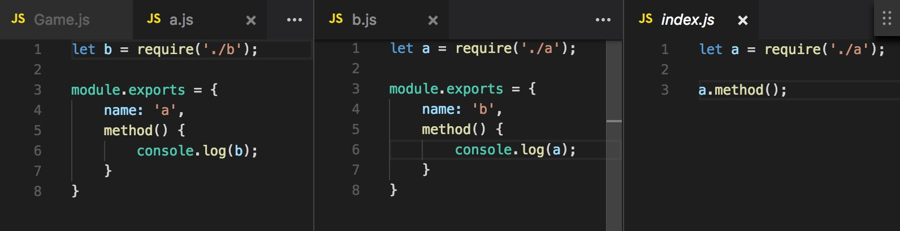
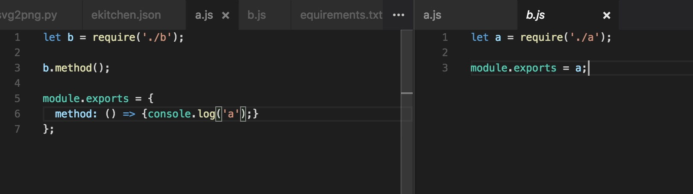
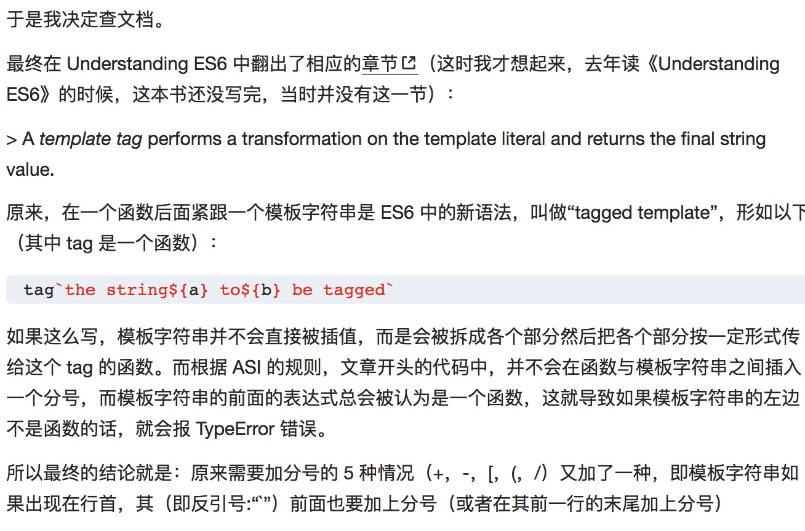
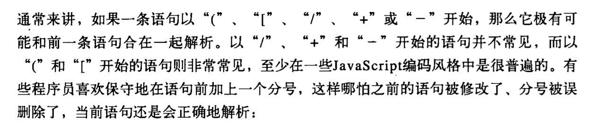
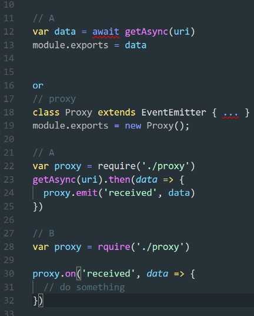

# 每日一题（也称大佬带我装逼带我飞）

[1. 这家前后端关系肯定好不到哪里去 出题人 B大](#1-这家前后端关系肯定好不到哪里去-出题人-b大)

[2. 这道算法题可以进leetcode 出题人 Y腿](#2-这道算法题可以进leetcode-出题人-y腿)

[3. 柯里化并不是那么容易 出题人 OlafCheng](#3-柯里化并不是那么容易-出题人-olafcheng) 

[4. 三题全家桶 出题人 斌 ](#4-三题全家桶-出题人-斌)

[5. 闭包 出题人 JS权威指南](#5-闭包-出题人-js权威指南)

[6. 连等赋值(外链至SE)](https://segmentfault.com/a/1190000004224719)

[7. script标签放在body最底部的原因(外链至SE)](https://segmentfault.com/a/1190000004292479)

[8. JavaScript Puzzlers(44题外链)](http://javascript-puzzlers.herokuapp.com/)

[9. 基础的闭包题](#9-基础的闭包题)

[10. BFC IFC CSS布局](#10-bfc-ifc-tfc-ffc-gfc-rfc)

[11. 函数的连续调用](#11-函数的连续调用)

[12. 考察New和原型链(外链至SE)](https://segmentfault.com/a/1190000007979730)

[13. 面试题杂谈](#13-面试题杂谈)

[14. 异步执行顺序(外链至SE)](https://segmentfault.com/a/1190000008595101)

[15. 循环依赖](#15-循环引用)

[16. 手写快速排序和选择排序](#16-手写快速排序和选择排序)

[17. 六种不能省略分号的情况](#17-六种不能省略分号的情况)

[18. node怎么使用module.export获得一个异步结果](#18-node怎么使用module.export获得一个异步结果)

[19. 计算一个字符串中各个字符的出现次数](#19-计算一个字符串中各个字符的出现次数)

### 1. 这家前后端关系肯定好不到哪里去 出题人 B大

这段php代码 可能输出一个 JSON 也可能输出空

```php
const foo = {
  bar: <?php>
}
```

输出json时示例如下

```php
const foo = {
  bar: {}
}
```

输出空的时示例如下

```php
const foo = {
  bar: 
}
```
很明显，输出空的时候会抛出异常，请问如何从js语法层面上解决这个问题

注：为防止XSS，应该避免使用eval和new Function

错误答案
```
1. ||
2. 三元
3. Object.assign({}, <%php%>) 因为不能保证这个JSON里没有引号，也不能保证没有反引号
4. escape escape传对象进去，会变成[Object object]
5. JSON.stringify() 
6. try catch 会报错……
```

思路：
```
JS语法中哪里可以不填东西，一个是Array 一个是函数的参数
```

正确答案：
```
1. [<%php%>][0]
2. (x => x)(<?php>)
```

欢乐吐槽时间：
```
Chobits：这样写代码的公司，前后端关系肯定好不到哪里去
小窝子：最好的解决办法不是叫后端输出个东西出来咩
一位乘客突然失去了梦想：这就是后端的锅
```

### 2. 这道算法题可以进leetcode 出题人 Y腿

已知一个字符串 aoobcooobaocoo，求包含abc（不限制顺序）的最小片段，这个字符串的片段为baoc

错误思路：
```
1. 正则 因为正则没有办法限制abc各出现一次
```

正确思路：
```
1. 将abc的索引值存入三个数组
2. 从三个数组中各取一个值，最大值和最小值相减记为cut，求cut最小值，并输出取出的三个值的索引。例：
var a,b,c,cut,index
a=[0,1,4,7,11]
b=[2,6,9,12]
c=[8,15,17]
cut = 2  index=[3,2,0]
3. 写出合适的算法
难点也在于写出合适的算法
```

算法思路：
```
1. 找相邻最近的ab ac bc各一个，然后取这三个值里的最大值，就是cut。最大值的两个点就是需要的index其中两个，b存不存在于剩下两组中需要笔头证明一下
2. 比如全排列一次 … 然后取其中的每种情况的最优解，因为数组里的数字本身是有序的，所以最多只需要遍历 xn 次，对 abc 的坐标数组顺序全排列一次，然后每种情况取一个递增序列，因为只要找到递增，就是这个情况的最优解了，所以 6 次查找也是 6*k*n = n …
```

### 3. 柯里化并不是那么容易 出题人 OlafCheng

实现如下函数：

```javascript
add(2,5) // 7
add(2)(5) // 7
```

思路：

```javascript
[].slice.call.(arguments).length
或javascript权威指南8.8.3不完全函数
Array.prototype.slice.call
```

错误答案：

```javascript
function add() {
  function calculate() {
    var arr = [].slice.call(arguments);
    switch(arr.length) {
      case 0:
        return 0;
      case 1:
        return arr[0];
      default:
        return arr.reduce(function(ac, cv) {
          return ac + cv;
        })
    }
  }
  var result = calculate(arguments); // 这样写是错误的
  function func() {
    result += calculate(arguments);
    return func;
  }

  func.toString = func.valueOf = function() {
    return result;
  }

  return func;
}
```

出错原因：

```javascript
出错的原因是, arguments 是 array-like，不是 array
内部细节，直接当做实参传的话，会调用它的 toString 属性，转换成'[object Arguments]'
然后传进去的参数就不是数组或者 arguments 本身了，而是一个字符串
进行如下修改即可

var result = calculate.apply(null, arguments);
function func() {
  result += calculate.apply(null, arguments);
  return func;
}
```
正确答案：

```javascript
var add = function () {
            var sum =+ Array.prototype.slice.call(arguments).reduce((a, b) => a + b, 0);
            return sum
          }

这个只支持add(1,2)
```

```javascript
const add = (...args) => {
  const calculate = (arr) => {
    return arr.length === 0 ? 0 : arr.length === 1 ? arr[0] : arr.reduce((ac, cv) => ac + cv);
  }

  let result = calculate(args);
  const func = (...args) => {
    result += calculate(args);
    return func;
  }
  func.toString = func.valueOf = () => result;
  return func;
}
```

### 4. 三题全家桶 出题人 斌 

1. 有如下HTML
    ```
    <ul>
      <li>1</li>
      <li>2</li>
      <li>3</li>
      <li>4</li>
    </ul>

      实现以下要求
      1. 点击 ul 所有li的数量
      2. 点击 ul 当前li的值
      3. 不用框架
    ```

2. 垂直居中的方法越多越好

3. lazyman

思路：

第一题
```
ul.children.length
```

第二题
```
1.line-height
2.0宽元素 inline-block
3.伪元素inline-block
4.translate -50%/-50% + absolute 50%/50%
5.absolute offset 0/0/0/0
6.table-cell
7.flex
8.table + writing mode
```
第三题

```
自己Google LazyMan js
```

### 5. 闭包 出题人 JS权威指南

```javascript
function constfuncs() {
  var funcs = []
  for(var i = 0; i<10; i++){
    funcs[i] = function() { return i }
  }
  return funcs
}

var funcs = constfuncs()
funcs[5]() // 10 如何返回5
```

思路：
```
js权威指南在 184-187讲述了闭包
闭包最有价值的地方在于，闭包return的值是一个私有变量，可以被私有方法修改
但是闭包和循环连用的时候容易出问题，产生的10个闭包是共享同一个变量的
想要循环后的变量是各自独立的，要立即执行才能达到效果
```

正确答案：
```javascript
funcs[i] = function()  { return i }
// 先在外面包上一层函数
funcs[i] = function () { return function() { return i } }
// 再立即执行即可
funcs[i] = (function (i) { return function() { return i } }(i))
```

### 9. 基础的闭包题
```javascript
var number = 2;
var obj = {
	number : 4,
	fn1 : (function() {		 
		this.number *= 2;
		number = number*2;
 		var number = 3;
		return function() {
			this.number *= 2;
			number *= 3;
			alert(number);
		}
	})(),
	db2:function(){ this.number *= 2 }
};

var fn1 = obj.fn1;
alert(number);//问这会会弹出什么结果 
fn1();//这会弹出什么结果 
obj.fn1();//这次弹出什么结果

alert(window.number); //这会window.number的结果是什么
alert(obj.number);   //这会obj.number的结果是什么
```

答案：
```javascript
4 /* 立即执行了
	  this.number *= 2;
		number = number*2;
 		var number = 3; 为局部变量
   */

9 /*
  var number = 3;
  return function() {
			this.number *= 2;
			number *= 3;
			alert(number);
		}
  */ 		

27 // 再次执行了闭包，9*3=27 

8 // 执行了两次，存值，闭包

8 // 执行了两次，未存值，非闭包

判断闭包：运行时的变量的引用被其他作用域的变量引用
```

### 10. BFC IFC TFC FFC GFC RFC

[css标准-论坛贴](http://bbs.csdn.net/topics/340173664)

[web规范9.8](https://www.w3.org/TR/CSS2/visuren.html#inline-formatting)

[BFC 块格式化上下文](https://developer.mozilla.org/zh-CN/docs/Web/Guide/CSS/Block_formatting_context)

### 11. 函数的连续调用
```javascript
function fun(n,o){
  console.log(o)
  return{
      fun:function(m){
          return fun(m,n);
      }
  };
}
var a = fun(0); a.fun(1); a.fun(2); a.fun(3);
var b = fun(0).fun(1).fun(2).fun(3);
var c = fun(0).fun(1); c.fun(2); c.fun(3);
```

答案：
```javascript
var a = fun(0);   //输出 undefined;,返回{fun:function(m){return fun(m,0);}}
a.fun(1);         //输出0; 返回{fun:function(){return fun(m,1)}};
a.fun(2);         //输出0; 返回{fun:function(){return fun(m,2)}};
a.fun(3);         //输出0; 返回{fun:function(){return fun(m,3)}};

var b = fun(0).fun(1).fun(2).fun(3);
//第一步：输出undefined;返回{fun:function(){m}{return fun(m,0)}}
//第二步: 输出0 返回{fun:function(m){return fun(m,1);}}
//第三步: 输出1，返回{fun:function(m){return fun(m,2);}}
//第三步: 输出2，返回{fun:function(m){return fun(m,3);}}

var c= fun(0).fun(1);
//第一步：输出undefined;返回{fun:function(){m}{return fun(m,0)}}
//第二步: 输出0 返回{fun:function(m){return fun(m,1);}}
c.fun(2);
//第一步: 输出1 返回{fun:function(m){return fun(m,2);}}
c.fun(3);
//第一步: 输出1 返回{fun:function(m){return fun(m,3);}}

打印的都是 o ,即返回函数的第二个参数，对照每一步的返回值即可得出答案
```

### 13. 面试题杂谈
问题：
```html
<ul>
<li>1</li>
<li>2</li>
<li>3</li>
</ul>  

点击ul显示li的长度
点击li显示li的内容

2. 问输出啥
for(let i = 0; i < 5; i++){
  setTimeout(() => console.info(i))
}

3. 如何搞定运营商劫持（某位不知名的大佬传授的

4.
var num = 10;
var obj = {
    num: 20,
    fn: (function (num) {
        this.num *= 2;
        num += 10;
        return function () {
            this.num *= 3;
            num += 1;
            console.log(num);
        }
    })(num)
};
var fn = obj.fn;
fn();
obj.fn();
console.log(window.num, obj.num);

5. "acctYestrtNew"按大写字母切割
```

答案：
```javascript
const $ul = document.querySelector('ul')
$ul.addEventListener('click', e => {
    const $target = e.target
    console.log($target === $ul
                ? $ul.children.length
                : $ul.children[[].indexOf.call($ul.children, $target)].innerText)
                
})

const $ul = document.querySelector('ul')
$ul.addEventListener('click', e => {
    const $target = e.target
    console.log($target === $ul
                ? $ul.children.length
                : $target.innerText)
})

2. 0、1、2、3、4 let作用于块作用域

3.
<!doctype html>
<!--<html></html>-->
<!—-<html><head></head><body></body></html>-—>
这个可以干掉运营商广告吗但是自己脚步也狗带了，可能放在头部和尾部

4.考察this绑定
fn(); // 21
obj.fn(); // 22
console.log(window.num, obj.num); // 60,60

思路：
我们尝试修改一下num
var num = 1;
var obj = {
    num: 20,
    fn: (function (num) {
        this.num *= 2;
        num += 10;
        return function () {
            this.num *= 3;
            num += 1;
            console.log(num);
        }
    })(num)
};
var fn = obj.fn;
fn(); // 12
obj.fn(); // 13
console.log(window.num, obj.num); // 6 60

var num = 1
var b = { 
		num:2,
		con:console.info(this.num,num,"this"), // 1, 1, this
		fun(){console.info(this.num, num)} // 2, 1
    fun:(function(console.info(this.num, num)){})() // 1, 1
}
函数的this才会绑上了对象内的属性，对象的属性a无法访问到属性b，即使是b.num依然报错

那么fn() obj.fn()的区别又在什么地方呢
fn = function () {
      this.num *= 3;
      num += 1;
      console.log(num);
    }

fn()的this绑的是window.num
obj.fn()的this绑的是obj.num

函数的this指向这个函数的调用者，如果没有，则是window
排除call，apply，bind以及箭头函数这些东西

5."acctYestrtNew"按大写字母切割
"helloWorld".replace(/[A-Z]/g, '-$1').split('-')

[].reduce.call('helloWorld', (arr, char) => {
  const code = char.charCodeAt()
  const offset = + (code >=65 && code <=90) - 1
  arr[arr.length + offset] = `${arr[arr.length + offset] || ''}${char}`
  return arr
}, [''])

"helloWorld".split('').reduce((a, b) => {
  return (b === b.toUpperCase ? a.push(b) : a.length ? a[a.length-1] += b :a.push(b), a)
}, [])
```

###  15. 循环引用

```
B大：就是node在处理模块的时候会为每一个文件建立一个空的module对象的引用

上大：先有引用，然后文件在第一次执行完毕之后，把这个引用指过去？

B大：对 先有引用 然后逐行运行 直到声明了 export 才有你期望的东西
```





### 16. 手写快速排序和选择排序

```
// 快速排序

// 选择排序

// hash 考察降维，降到 O(n) 为目标

// 数据结构 贪心 动态规划 分治
```

###  17. 六种不能省略分号的情况

```
" + ", " - ", " / ", " [ ", " { ", " ` "
以上字符开头时不能省略
```





### 18. node怎么使用module.export获得一个异步结果

```
可利用 readFileSync 和 writeFileSync 强行同步
但是涉及 io 操作性能会下降(这不就是强行中断主线程吗,类似alert)
https://github.com/node-modules/urllib-sync
```



### 19. 计算一个字符串中各个字符的出现次数

```javascript
var arr = 'dfsa dawefafa sfar32rcweacasfw1eassfa'
arr.split('').reduce((p, k) => (p[k]++ || (p[k]=1), p), {})
```